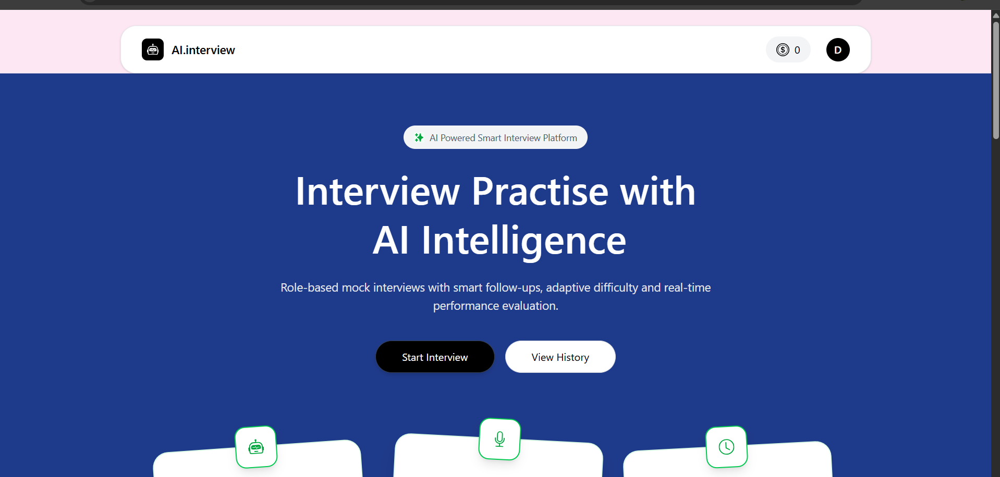
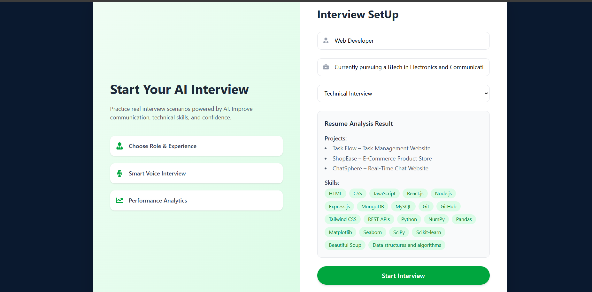
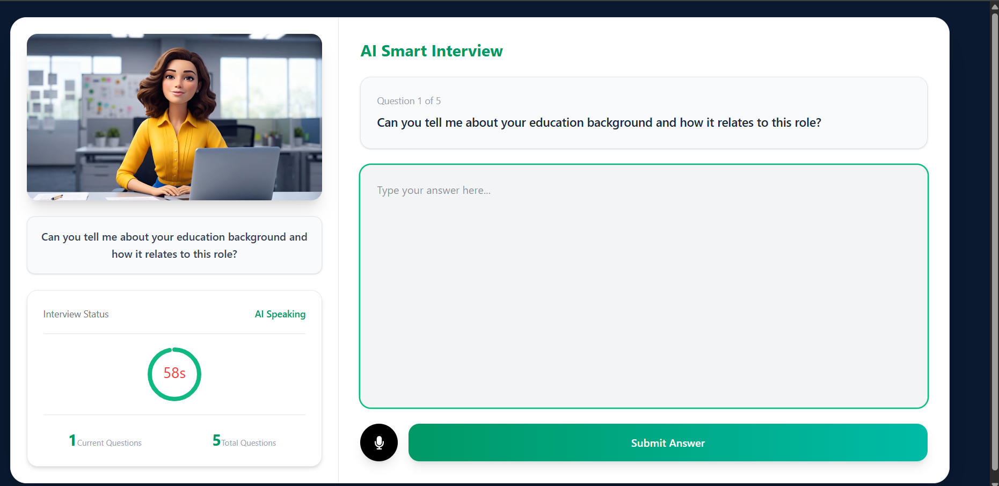
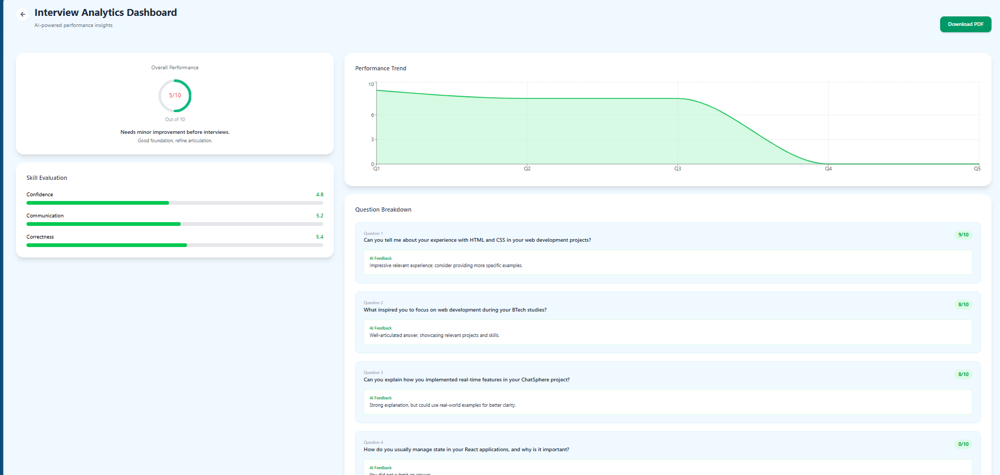

# 🚀 AI Interview Platform

<p align="center">
  <strong>AI-Powered Mock Interview Platform for Technical & HR Preparation</strong>
</p>

<p align="center">
  Practice personalized technical and behavioral interviews, receive AI-generated feedback, analyze resumes, and track your preparation journey through a complete interview intelligence platform.
</p>

<p align="center">
  
  
  
  
  
  
  
</p>

---

## 📸 Product Showcase

### 🏠 Landing Page

<p align="center">
  
</p>

The landing page introduces the platform and provides users with a seamless starting point for AI-powered interview preparation.

---

### 📋 Resume Analysis & Interview Setup

<p align="center">
  
</p>

The platform parses uploaded resumes, extracts projects, skills, and experience, and generates personalized interview questions tailored to the candidate's profile.

---

### 🎤 AI Interview Session

<p align="center">
  
</p>

The interview interface provides a realistic mock interview experience with dynamic questioning, voice interaction, timers, and performance evaluation.

---

### 📊 Interview Result Analysis

<p align="center">
  
</p>

The Interview Result Analysis dashboard delivers comprehensive AI-generated feedback, including performance scores, strengths and weaknesses assessment, response evaluation, and personalized recommendations to help candidates improve their interview readiness.

---

## 🎯 Overview

AI Interview Platform is a full-stack SaaS application designed to simulate real-world technical and HR interviews using Artificial Intelligence.

Unlike traditional interview preparation tools that rely on static question banks, this platform analyzes a candidate's resume and dynamically generates interview questions based on skills, projects, technologies, and experience.

The platform combines AI-powered question generation, resume intelligence, secure authentication, payment integration, and performance analytics into a complete interview preparation ecosystem.

---

## ✨ Key Features

### 📄 Resume Intelligence

* Upload resumes in PDF format
* Automated resume parsing
* Skill extraction and classification
* Experience and project analysis
* Candidate profile understanding
* Context-aware interview generation

### 🤖 AI-Powered Interview Generation

* Resume-based interview creation
* Dynamic question generation
* Personalized interview sessions
* Technical interview mode
* HR interview mode
* Adaptive questioning

### 🎤 Realistic Interview Experience

* Interactive interview sessions
* Smart follow-up questions
* Voice-enabled responses
* Live timer tracking
* Real-time evaluation

### 🧠 AI Feedback Engine

* Performance scoring
* Strength analysis
* Weakness identification
* Personalized recommendations
* Detailed evaluation reports

git add .
git commit -m "Nudge Vercel to rebuild"
git push origin main
### 📊 Analytics Dashboard

* Interview history
* Performance tracking
* Progress monitoring
* Historical comparisons
* Skill-based analytics

### 💳 Credit-Based SaaS System

* Credit management
* Usage tracking
* Premium interview access
* Razorpay integration

### 🔐 Authentication & Security

* Google Sign-In
* Firebase Authentication
* JWT Authorization
* Protected Routes
* Secure Session Management

---

## 🚀 Feature Highlights

### 🎯 Resume-Based Personalization

Generate interview questions directly tailored to a candidate's skills, projects, technologies, and experience.

### 🧠 AI-Powered Evaluation

Receive detailed interview feedback with actionable improvement suggestions.

### 📈 Progress Tracking

Monitor interview performance through analytics and historical reports.

### 💳 Secure Payment Integration

Purchase credits securely using Razorpay.

### 🔒 Enterprise-Grade Authentication

Google Sign-In powered by Firebase Authentication with JWT-protected APIs.

---

## 🎯 Use Cases

* Software Engineering Interview Preparation
* Technical Mock Interviews
* HR & Behavioral Interview Practice
* Internship Preparation
* Placement Preparation
* Communication Skill Improvement
* Resume-Based Interview Simulation

---

## 🏗️ Tech Stack

### Frontend

| Technology    | Purpose                    |
| ------------- | -------------------------- |
| React.js      | User Interface Development |
| Tailwind CSS  | Responsive Styling         |
| Framer Motion | Animations                 |
| React Router  | Client-Side Routing        |
| Axios         | API Communication          |
| Vite          | Development & Build Tool   |

### Backend

| Technology | Purpose              |
| ---------- | -------------------- |
| Node.js    | Runtime Environment  |
| Express.js | REST API Development |
| JWT        | Authentication       |
| Multer     | File Uploads         |
| PDF Parser | Resume Extraction    |

### Database

| Technology | Purpose         |
| ---------- | --------------- |
| MongoDB    | Data Storage    |
| Mongoose   | Schema Modeling |

### AI Services

| Technology            | Purpose               |
| --------------------- | --------------------- |
| OpenRouter API        | Question Generation   |
| Large Language Models | Evaluation & Feedback |

### Authentication

| Technology              | Purpose               |
| ----------------------- | --------------------- |
| Firebase Authentication | Google Sign-In        |
| JWT                     | Secure Backend Access |

### Payments

| Technology | Purpose            |
| ---------- | ------------------ |
| Razorpay   | Payment Processing |

### Deployment

| Technology    | Purpose             |
| ------------- | ------------------- |
| Render        | Application Hosting |
| MongoDB Atlas | Cloud Database      |

---

## 🏛️ System Architecture

```text
User
 │
 ▼
React Frontend
 │
 ├── Firebase Authentication
 ├── Resume Upload
 ├── Interview Dashboard
 │
 ▼
Node.js + Express Backend
 │
 ├── OpenRouter API
 ├── MongoDB Atlas
 ├── Razorpay
 └── JWT Authentication
 │
 ▼
Resume Analysis
Interview Generation
AI Evaluation
Performance Analytics
```

---

## 🧠 Engineering Challenges Solved

### Resume-Aware Question Generation

Designed an AI workflow capable of understanding resumes and generating context-specific interview questions.

### AI Feedback Pipeline

Built a system that transforms interview responses into structured evaluations and actionable recommendations.

### Credit-Based Monetization

Implemented a SaaS-style architecture supporting premium interview access through a credit system.

### Secure Authentication

Integrated Firebase Authentication with JWT-secured backend APIs and protected application routes.

### Scalable Backend Design

Separated controllers, services, middleware, and business logic for maintainability and scalability.

---

## 📊 Project Highlights

* AI-Powered Interview Generation
* Resume Intelligence Engine
* Technical & HR Interview Modes
* Personalized Feedback Reports
* Firebase Authentication
* Razorpay Payment Gateway
* Credit-Based SaaS Architecture
* Production Deployment
* Responsive User Experience
* Full-Stack MERN Architecture

---

## 📂 Project Structure

```text
AI-Interview-Platform
│
├── client
│   ├── assets
│   │   ├── home.png
│   │   ├── interview.png
│   │   └── resume_analyse.png
│   ├── src
│   └── public
│
├── server
│   ├── config
│   ├── controllers
│   ├── middleware
│   ├── models
│   ├── routes
│   ├── services
│   └── utils
│
└── README.md
```

---

## ⚙️ Environment Variables

### Server (.env)

```env
PORT=3000

MONGODB_URL=your_mongodb_connection_string

JWT_SECRET=your_jwt_secret

OPENROUTER_API_KEY=your_openrouter_api_key

RAZORPAY_KEY_ID=your_razorpay_key_id
RAZORPAY_KEY_SECRET=your_razorpay_key_secret
```

### Client (.env)

```env
VITE_FIREBASE_APIKEY=your_firebase_api_key

VITE_RAZORPAY_KEY_ID=your_razorpay_key_id
```

---

## 🛠️ Local Installation & Setup

### Install Backend Dependencies

```bash
cd server
npm install
```

### Install Frontend Dependencies

```bash
cd client
npm install
```

### Start Backend Server

```bash
cd server
npm run dev
```

Backend runs on:

```text
http://localhost:3000
```

### Start Frontend

```bash
cd client
npm run dev
```

Frontend runs on:

```text
http://localhost:5173
```

---

## 🎓 Skills Demonstrated

* Full-Stack Development
* AI Integration
* Prompt Engineering
* REST API Development
* Authentication & Authorization
* Payment Gateway Integration
* Database Design
* Cloud Deployment
* SaaS Product Architecture
* Modern UI/UX Design

---

## 📄 License
This project is licensed under the MIT License.

---

<p align="center">
</p>
